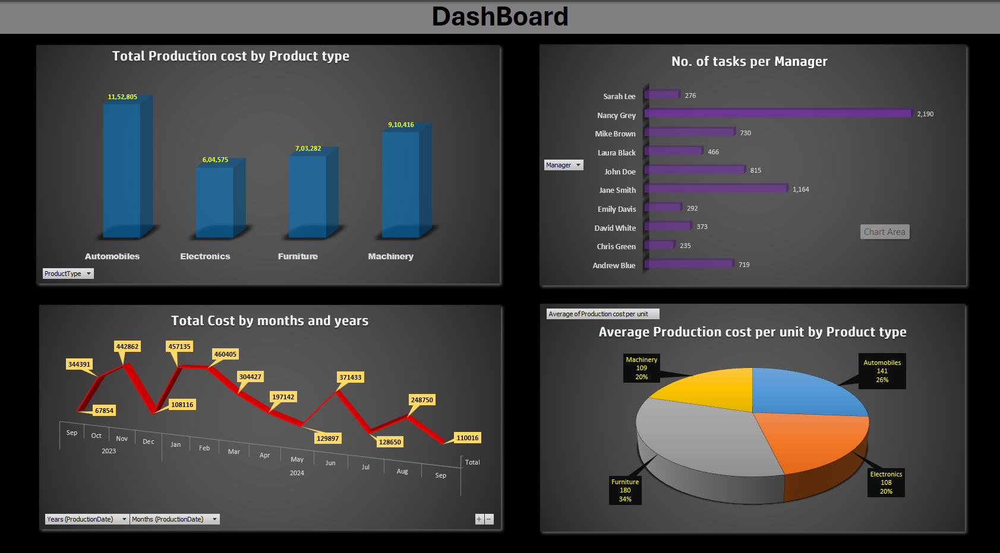

# 📈 Data Analytics Excel Project - Sales & Production

This project focuses on analyzing sales and production data using **Microsoft Excel**. It includes **performance KPIs**, **trend visualizations**, and a fully interactive **dashboard** to provide business insights for decision-makers.

---

## 🖼 Dashboard Preview

  
*A dynamic Excel dashboard with slicers, charts, and KPI highlights*

---

## 🎯 Project Objectives

- Track sales and production metrics over time  
- Compare actual performance against targets  
- Identify production gaps, surplus, or unmet demand  
- Visualize trends with dynamic filters

---

## 🔧 Tools & Excel Features Used

- Pivot Tables & Pivot Charts  
- Slicers for interactivity  
- Conditional Formatting  
- SUMIFS, IF, and other core Excel formulas  
- Dashboard Design using linked cells and charts

---

## 🔍 Key Insights

- 📅 **Monthly Trends**: View production vs. sales performance by month  
- 📊 **Top Products**: Identify best-selling items  
- 🏭 **Efficiency Check**: Spot overproduction or stock shortfalls  
- 📈 **Growth Tracking**: Analyze year-over-year or seasonal patterns

---
[Click to view Project Video / Linkdin Post](https://www.linkedin.com/posts/zodrick-john-1689a8256_exceldashboard-salesanalysis-productionplanning-activity-7321199204368883712-aUen?utm_source=share&utm_medium=member_desktop&rcm=ACoAAD8mrOABsUmTOAKWlhdQdbjigs27IxTaqzA)

